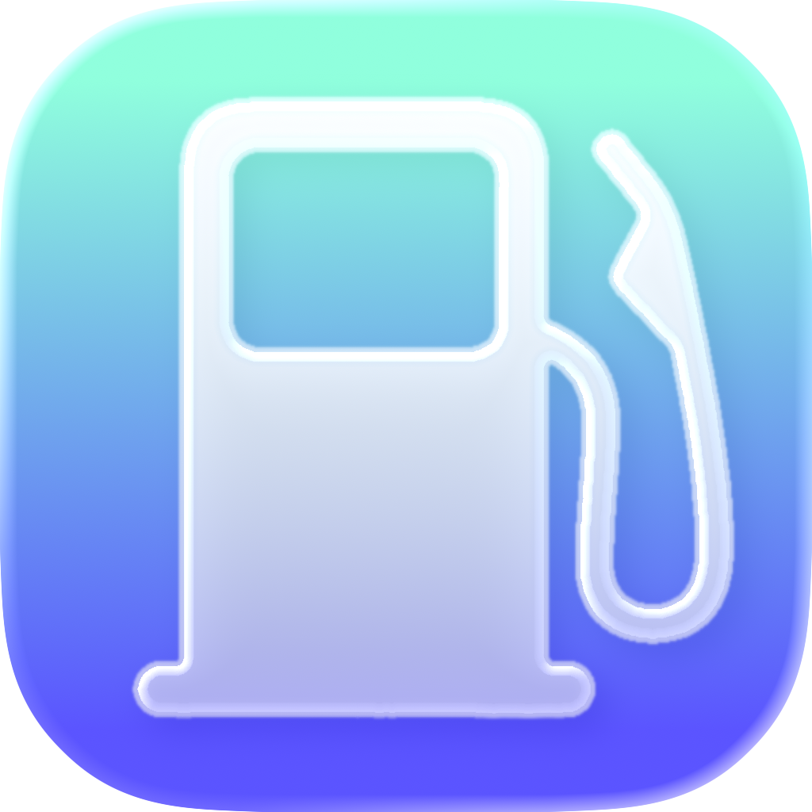

<table align="center">
  <tr>
    <td valign="middle">
      
    </td>
    <td valign="middle">
      <picture>
        <source media="(prefers-color-scheme: dark)" srcset="./assets/FuelUp-text-logo-dark.png" />
        <source media="(prefers-color-scheme: light)" srcset="./assets/FuelUp-text-logo-light.png" />
        
      </picture>
    </td>
  </tr>
</table>

<p align="center">
  Native iOS-first gas discovery focused on one thing:
  <br />
  <strong>the fastest, closest, cheapest fuel price near you.</strong>
</p>

<p align="center">
  
  
  
  
</p>

## Overview

Fuel Up is a mobile app built with Expo + React Native to help users find nearby gas stations with the best price quickly, with a native-feeling iOS experience.

## Product Priorities

1. Native, beautiful, simple design.
2. Fastest path to the closest, cheapest gas.

## Key Features

- Apple-native map-first fuel discovery experience.
- Clustered gas-price overlays with split/merge transition handling.
- Location-aware nearest/cheapest station targeting.
- Dark and light theme support.
- Live quality gate for cluster animation smoothness in iOS Simulator.

## Tech Stack

- Expo 55
- React Native 0.83
- Expo Router
- React Native Maps
- Liquid Glass (`@callstack/liquid-glass`)
- Supabase

## Project Structure

```text
app/        Expo Router routes
src/        App features, components, hooks, services
assets/     Icons, logos, media
tests/      Unit tests + live cluster probe integration test
scripts/    Project helper scripts
```

## Getting Started

### Prerequisites

- Node.js 20+
- npm
- Xcode + iOS Simulator (for iOS workflows)

### Install

```bash
npm install
```

### Run

```bash
npm run ios:sim
```

You can also start Expo directly:

```bash
npm start
```

## Testing

### Unit Test Suite

```bash
npm test
```

### Cluster Probe Integration Test (iOS Simulator)

```bash
node --test ./tests/clusterProbe.integration.test.cjs
```

For full validation (unit + cluster checks):

```bash
npm run test:cluster
```

## Scripts

| Script | Description |
| --- | --- |
| `npm start` | Start Expo dev server |
| `npm run ios` | Build/run on configured physical iOS device |
| `npm run ios:sim` | Launch app in iOS simulator via Expo |
| `npm run android` | Build/run Android app |
| `npm run web` | Start web target |
| `npm test` | Run default unit tests |
| `npm run test:cluster` | Run cluster animation math + simulator probe tests |

## Bundle IDs

- iOS: `com.anthonyh.fuelup`
- Android: `com.anthonyh.fuelup`

## License

Private project.
