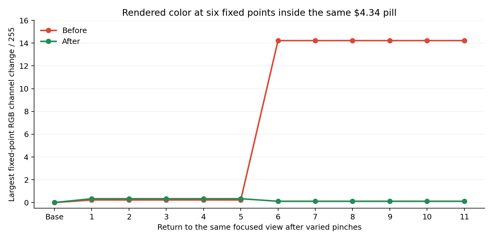

# Glass Lab color checkpoints — September 29, 2026

The user's fixed-point test reproduced a rendered-color change that the tint
property assertions missed. At the same focused camera, a neighboring glass
container changed from behind the selected pill to in front of it. Its native
shadow darkened the upper part of the selected pill. Restarting the same build
restored the previous container order and exact baseline sampled colors.

## Measurement

- iPhone 13 mini simulator, iOS 26.5, real MapKit, actual cached Tampa stations.
- Circle K $4.34 and its neighboring cluster; the station quotes stayed unchanged.
- Two fixed checkpoints: Show all, and native focus on Circle K from Show all.
- Vary pinch centers inside that cluster, zoom in and out, vary gesture duration,
  and perform two gestures between some checkpoint returns. No app reload between
  the twelve overview returns and twelve focus captures.
- Three initial idle screenshots are the noise control. Later cycles include a
  second capture after another 1.1 seconds to distinguish settling from persistence.
- Before: 35 screenshots plus one restart control. After: 35 screenshots plus
  one final-build control; 72 screenshots total.
- Full-resolution 1080 × 2340 PNGs captured by Argent, not UIView snapshots.
- Six fixed 3 × 3 pixel patches per pill at x = 30%, 50%, 70% and y = 17%, 83%
  of its baseline bounds. Compare their mean RGB values against the same absolute
  screenshot pixels. Also retain median RGB from text-free upper/lower bands.
- Exclude pills covered by the card/tab area. AX geometry is rounded to 0.001;
  matches allow that rounding and report mismatched positions separately.
  There were zero geometry mismatches. This is not a claim of exact subpixel
  MapKit raster alignment.

Reproduce the measurements from a capture manifest with:

```sh
python3 scripts/measureClusterLabColors.py path/to/manifest.json
```

The manifest's `captures` entries contain `checkpoint`, `cycle`, PNG `path`, and
the corresponding Argent `tree`. Requires Pillow and numpy. Raw screenshots and
manifests are under `.argent/color-checkpoints/2026-09-29/{before,after}` locally;
the reviewed chart and all numeric measurements are committed here.

## Result

Largest RGB channel change at a fixed 3 × 3 patch, on the 0–255 scale:

| Sample | Before | After |
| --- | ---: | ---: |
| Idle captures | 0.00 | 0.00 |
| Focused Circle K $4.34 | 14.22 | 0.33 |
| Neighboring Marathon $4.38 at focus | 4.44 | 1.22 |
| Maximum across every sampled pill/checkpoint | 14.22 | 4.78 |



The old focused-pill darkening began on return 6 and persisted through return 11,
including delayed captures. Its tint-band median changed from RGB (251, 208, 201)
to (243, 202.5, 196). Native hierarchy inspection showed the two containers in
opposite paint order before/after the affected sequence. A restart restored
RGB (251, 208, 201) and the original ordering.

The change separates canonical spatial pooling/paint depth from physical effect
reuse, then restores deterministic UIKit container and child order. It retains
pooled effects and native morphing. The earlier handoff, overview-camera, and
direct UIKit layout corrections alone did **not** resolve this reproduced issue.

Remaining small changes at other sample points are included in the table and
[raw measurements](evidence/2026-09-29-glass-colors/pixel-measurements.json).
This does not establish zero pixel variation or resolve every color change on
the physical phone. The iOS 27 phone became unavailable to device tools before
this final stacking build could be installed or measured there.

## Other checks

- 138 unit tests and native grouping model: passed.
- Simulator and signed device builds: passed.
- Full native Glass Lab regression suite: all 14 passed on the final build,
  including six overview returns with identical membership, glass connections,
  paint order, tint, and geometry.
- An earlier run had intermittent first-frame fit/location failures. The renderer
  now uses the available user coordinate without waiting for MapKit's delayed
  visibility flag; both first-frame gates passed in the final full run.
- Required older Home probe: failed by timeout waiting for its exported report.
  Home's `ENABLE_CLUSTER_MERGE_TRANSITIONS` remains disabled; its gate was not
  weakened or removed.
