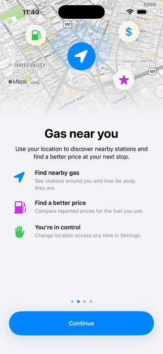
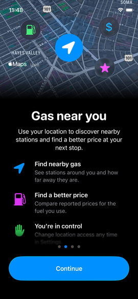
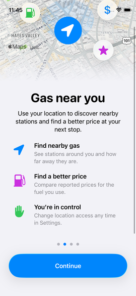
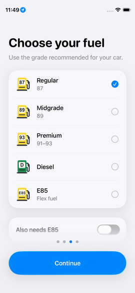

# Location onboarding reference redesign — October 2, 2026

Replaced the small location card with a full-width tilted Apple map illustration, native SF Symbols and Liquid Glass icon surfaces, a centered heading and explanation, and three short benefits. The map is illustrative: it does not claim to show the user location or observed prices. The title, illustration and benefits share one scroll view.

The existing Continue action presents the genuine iOS location permission dialog. Granting While Using App automatically advanced to Choose your fuel (page 3 of 4) on the compact simulator. Permission denial and location error handling remain in place.

## Verification

- Debug simulator and signed Release device builds succeeded.
- 28 focused onboarding, assets, state continuity and preference tests passed.
- iPhone 13 mini simulator: checked light and dark layouts. All three benefits are accessible by a short scroll; content moves together and the native footer softly obscures content passing behind it.
- iPhone 17 Pro Max simulator: all content fits without scrolling at the default text size.
- Installed the Release build on Anthony’s iPhone 18 Pro Max; devicectl reported success for com.anthonyh.fuelup. Physical-device visual behavior was not independently tested, and the phone app was not launched.
- Theme overrides and hiding the existing Debug-only notification warning were temporary simulator QA operations; source behavior was not changed for those operations.

## Evidence

