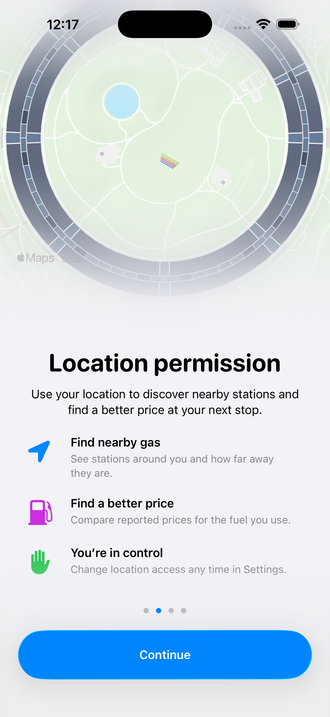
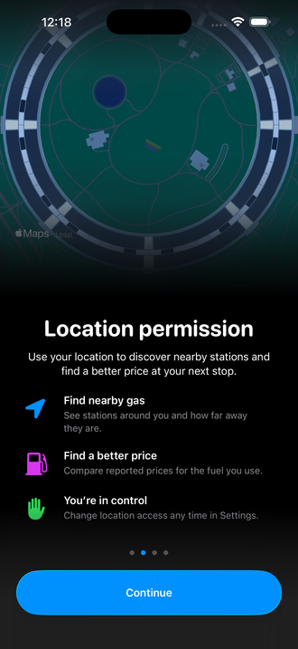
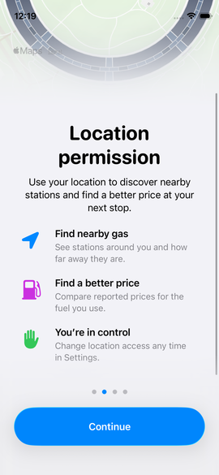
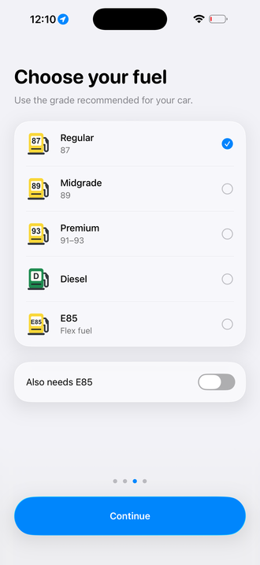
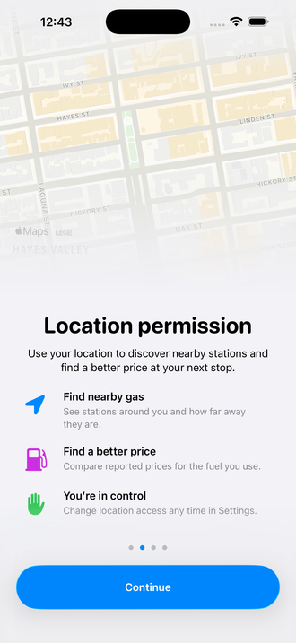
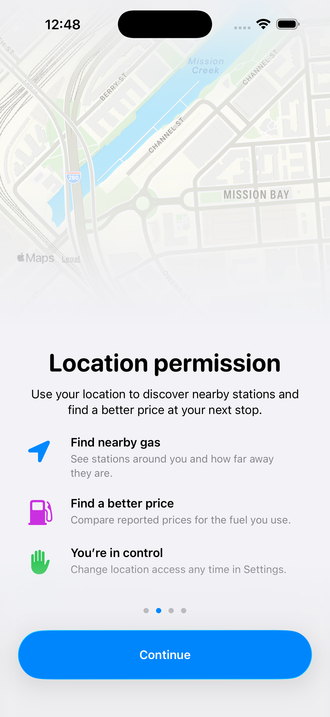
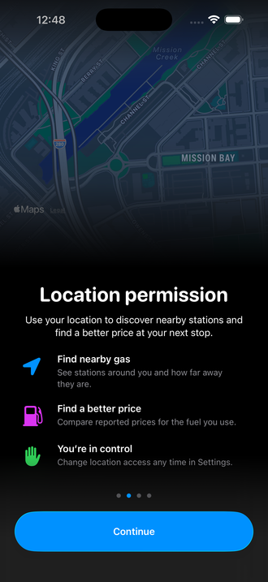
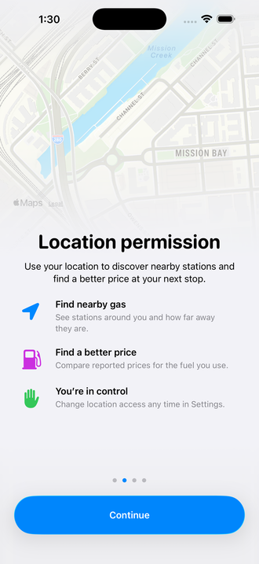
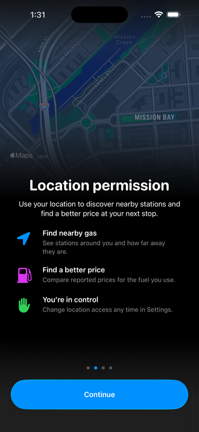

# Stationary onboarding controls and Apple Park illustration

## Result

Continue and the page indicator now live once above the native page controller. The entire page content slides while the controls remain stationary. Each page reserves the measured footer height, including changes in text size, and a native material fade protects the controls from scrolling content. There are no hidden duplicate buttons.

Location permission uses an edge-to-edge, illustrated 2D Apple Park map, tightly framed with no added symbols or visible road/place labels. The map occupies 46–47% of the initial screen height on the checked phones. MapKit attribution remains. Both image edges blend gradually through native material. The title and illustration scroll with the benefit rows.

## Validation

- Debug simulator and signed Release builds succeeded; 28 focused onboarding, asset, state continuity and preference tests passed. No cluster behavior changed; the live cluster probe was not run for this work.
- iPhone 17 Pro Max simulator: verified light and dark location layouts.  Continue has the same normalized frame (0.055, 0.879, 0.891, 0.069) on welcome, location, fuel, and preferences; the final page changes its label to Find gas.
- iPhone 13 mini simulator: verified title wrapping and scrolling until every benefit is readable. Recorded welcome-to-location and inspected intermediate frames: the page slides horizontally while Continue stays fixed. Native map tiles load during the initial transition. Continue retains frame (0.064, 0.857, 0.872, 0.081) before and after scrolling.
- Real iOS permission dialog was presented from Continue. Allow While Using App automatically advanced to Choose your fuel, then Continue advanced to Gas preferences.
- Existing Debug-only notification/keychain warnings were temporarily hidden for screenshots. Native theme override was temporary and cleared by restarting the simulators afterward.
- Installed Release on Anthony’s iPhone 18 Pro Max. devicectl confirmed success for com.anthonyh.fuelup. The phone app was not opened; visual QA was performed in simulators. Landscape and enlarged Dynamic Type were not independently exercised in this pass.

## Evidence

[Page transition recording](evidence/2026-10-02-stationary-onboarding/stationary-continue.mp4)

Native map appearance uses [Apple’s standard map configuration](https://developer.apple.com/documentation/mapkit/mkstandardmapconfiguration) with flat elevation, muted emphasis, and points of interest excluded..

## San Francisco follow-up

At the user’s request, the map center moved to Hayes Valley in San Francisco (37.7765, -122.4241). The same large flat illustrated map, framing, progressive edge treatment, and stationary footer remain. The accessibility label now names San Francisco. Native muted cartography still includes faint street names in this neighborhood; POIs and custom symbols remain absent.

The signed Release and simulator builds passed, along with the same 28 focused tests. The final map was visually checked in the large simulator and Release installation on Anthony’s iPhone 18 Pro Max succeeded. The phone app was not launched.

## Mission Creek composition

The user requested a more interesting location matching the reference's mix of water, greenery, and city blocks. Reframed the native 2D illustration around Mission Creek (37.7720, -122.3954) with a 1,500 m camera distance so the waterway, park edges, and neighboring blocks appear together. The hero size, native edge material, stationary footer, and permission behavior are unchanged. Native street labels remain; no custom symbols were added.

Both simulator and signed Release builds passed, plus 28 focused onboarding and preference tests. Light and dark appearance were visually checked in the iPhone 17 Pro Max simulator.

Location reference: [Mission Creek Park, San Francisco Recreation and Parks](https://www.sfrecpark.org/Facilities/Facility/Details/Mission-Creek-Park-North-and-South-449).

Release installation on Anthony’s iPhone 18 Pro Max succeeded. The phone app was not opened.

## Location content spacing

Moved the title, description, benefits, and permission status up by 30 points into the map fade by reducing the illustration's bottom layout spacing. The map frame and stationary footer remain unchanged. Simulator accessibility bounds confirm the title moved from normalized y=0.485 to 0.454 on the 956-point display (approximately 30 points), with Continue still at (0.055, 0.879, 0.891, 0.069). Visually checked the resulting overlap. Debug simulator and signed Release builds passed; Release installation on the iPhone 18 Pro Max succeeded. No phone app launch.

## Full-size map with overlapping content

After the user clarified that the content should enter the blur rather than change map spacing, replaced the negative-padding layout. The illustration is now an independently sized background, and the content begins 50 points above its bottom edge. On the large simulator the map stays at 440 points (normalized height 0.460), the title begins at y=390 (0.408), and Continue retains its exact frame. The map and content still scroll together. Light and dark visual checks passed, as did Debug and signed Release builds and all 28 focused onboarding/preference tests.

Corrected Release installed on Anthony’s iPhone 18 Pro Max; the phone app was not opened.

## Tighter content spacing

Reduced the location title-to-description gap from 12 to 10 points, the section gap from 24 to 18, and benefit-row gaps from 22 to 16. The full-size map, 50-point overlap, and fixed footer are unchanged. The large simulator confirms the title remains at normalized y=0.408 and Continue at (0.055, 0.879, 0.891, 0.069), while the benefit rows are closer together. Both builds passed and the Release installed successfully on the iPhone 18 Pro Max without launching it.
