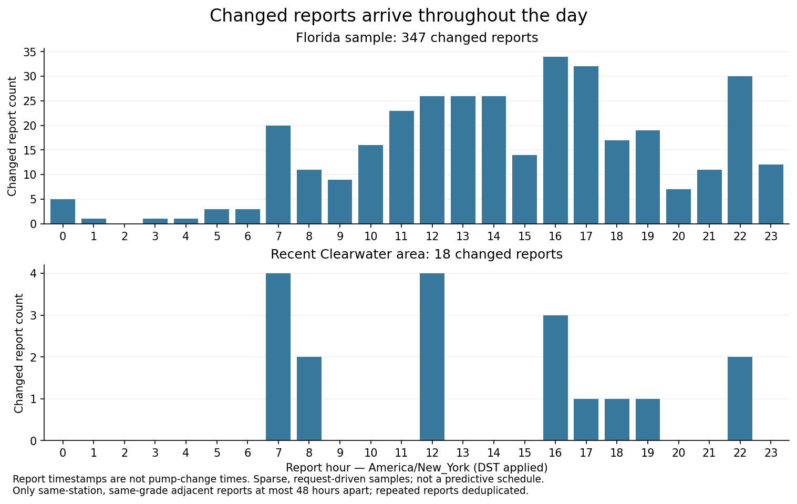

# Price reliability audit — September 30, 2026

The current system detects suspicious prices, but does not select the best
station by calibrated price reliability. It ranks primarily by displayed price,
including adjusted prices. The cache does not establish a dependable pump-change
schedule or prove which reported prices are actually wrong.

No application, pricing policy, or deployed function was changed in this audit.
The accepted cluster implementation is tagged `glass-clusters-v1.0.0` at
`738516ece1c2fb2c77d034808cc40926089b22f8`. Its component files and hashes are in
[the version manifest](../../versions/glass-clusters-v1.0.0.json).

## Data examined

At 12:31pm Eastern, exported 9,095 accessible `station_prices` rows, covering
943 station IDs and 44 UTC observation dates from March 1 through September 30.
This is sparse history: March, April, May, and September are represented;
June through August are absent. All rows identify GasBuddy as provider.
The export excludes user UUIDs. A fixed retrieval cutoff and `(created_at, id)`
ordering keep pagination stable while other clients write.

Two bounded live provider requests used Clearwater coordinates
27.979, -82.756, one premium and one regular. Each returned 20 upstream stations;
the existing grade sanitizer produced 13 premium and 17 regular quotes.
A normal production `gas-prices` premium request returned 39 stations via
`cache-fill`, not a forced live refresh. Direct provider queries verify the
upstream state independently of that production cache response. Normal endpoint
cache writes may occur; no deployment or manual database edits were performed.

| Current premium evidence | Result |
| --- | ---: |
| Direct-provider quotes matching the latest stored raw price AND source time | 13 / 13 |
| Production quotes | 39 |
| Accepted / quarantined / rejected | 9 / 24 / 6 |
| Quotes replaced by a prediction plus safety buffer | 30 / 39 |
| Replaced quotes still carrying `isEstimated: false` | 30 / 30 |
| Quotes whose source report is over 24 hours old | 26 / 39 |
| Median / oldest source report age | 40.6 / 87.0 hours |

“Quarantined” and “rejected” describe the original feed quote. Those stations are
still returned with replacement prices. These are heuristic outcomes, not
confirmed errors or pump-price accuracy measurements.

Wawa at 2177 Gulf to Bay Blvd (station 172657) still reports premium **$4.84**, last
reported September 28 at 4:28pm Eastern, approximately 44 hours before this check.
The production validator rejects that feed quote, predicts $5.031, adds its
$0.10 buffer, and returns **$5.131** (displayed $5.13). We did not verify its pump.
Mobil at 22995 US-19 is the cheapest returned quote at $5.07, accepted and
unadjusted, reported about 3.6 hours before the check.

## Existing reliability logic

- Prefers credit prices, falling back to cash, and suppresses suspicious duplicate
  gasoline-grade prices. This is a sanity check, not proof of a correct grade.
- Builds a historical validation context from up to 1,500 rows in the exact
  rounded search-area/fuel bucket over 14 days. This Clearwater premium bucket
  had 813 rows, so its current sample was not truncated by that limit.
- Predicts from nearby stations, weighting distance and observation age; combines
  this with the station's historical difference from the market and its last
  trusted quote. Neighbor tiers expand from 4 to 8 to 20 miles as needed.
- Scores a low outlier, absolute deviation, unexpected jump, repeated stale
  source, flat reported price, and source age. Accepts at validity >= 0.72,
  rejects below 0.48, otherwise quarantines, with additional override rules.
- A same-source replay at least six hours old and at least $0.18 below the
  prediction is rejected. Three-hour replays with a sufficient gap can be
  quarantined. The timestamp replay tolerance is five minutes.
- Replaces a rejected/quarantined price when a prediction exists, adding $0.10.
  Cold starts with no prediction accept the raw quote instead.
- Final normal and Glass Lab selection sorts by displayed price, then distance
  or stable station ID. Validation risk is not a ranking priority.

Sources: [validation](../../../src/services/fuel/priceValidation.js),
[history/metadata](../../../src/services/fuel/stationData.js),
[service cache](../../../supabase/functions/_shared/gasPrices.mjs),
[normal ranking](../../../src/services/fuel/index.js),
[Glass Lab ranking](../../../src/screens/cluster-lab/stationCardModel.js).

## Confirmed gaps

1. **Newer can be mistaken for trustworthy.** A source timestamp more than five
   minutes newer than the last trusted report, together with a changed price,
   forces acceptance and validity 1. It need not be recent relative to now and
   bypasses even a large market outlier. A synthetic diagnostic using the real
   validator accepted $2.00 against a $5.14 prediction with a two-day-old source
   timestamp because the prior trusted timestamp was four days old. This is a
   demonstrated code path, not an observed $2 station. See
   [diagnostic](fresh-bypass-diagnostic.json). Validity is not a calibrated
   probability of pump accuracy.
2. **Grade report timestamps are lost.** The provider supplies cash/credit
   timestamps for each grade. Normalization stores one selected-grade
   `updatedAt`; history validation applies it to every grade in `allPrices`.
   Today, 7-Eleven station 67766 had regular reported September 30 at 12:21pm,
   but premium September 29 at 12:22pm—almost 24 hours apart. A regular quote
   therefore makes that premium data look newer when used as multi-grade history.
3. **Adjusted station prices retain the non-estimated flag.**
   `validation.usedPrediction` survives in returned metadata, but `isEstimated`
   remains false. The React card does show an estimate information icon using
   validation metadata. The station filter and native cheapest-price selection
   do not use that metadata, so an adjusted quote can qualify for first place
   and green. Simply flipping the flag would hide stations under existing
   filters; this needs a deliberate reported/estimated eligibility contract.
4. **Fresh cache does not mean fresh price.** The server's 10-minute cache is
   about fetching. One recent row can enable area-cache reuse for older stations
   in that bucket. Older history fills gaps absent from live results. Today's
   refresh comparison returned the same 13 premium reports, so polling more
   frequently alone would not have improved those report ages.
5. **History is not clean ground truth.** Repeated fetches append the same source
   reports. The validator can count them repeatedly in trusted history and station
   offsets. Stored `price`/scalar `all_prices` may contain model adjustments;
   raw credit/cash prices survive in `_payment` where present. 2,254 stored rows
   have a selected raw amount different from their stored `price`. No explicit
   persisted validation decision accompanies those rows. Preserve raw reports
   and derived prices separately before trying to measure prediction accuracy.

## Time-of-day findings

For temporal analysis, use only each row's selected fuel grade, since timestamps
for its other grades are unreliable. Prefer raw `_payment.credit`, then cash,
then the selected scalar/row fallback. Do not count model-adjusted display prices
as new upstream prices when raw payment data exists. All recent rows have selected
grade payment data; 354 historical rows do not, so the older sample has additional
provenance uncertainty.

Deduplicate by station ID, selected fuel grade, and source timestamp; exclude
timestamps carrying conflicting prices or more than five minutes into the future.
Compare adjacent source reports only if at most 48 hours apart, and count a change
at $0.009 or larger. Convert timestamps with America/New_York, including DST.
The Florida sample is bounded to latitude 26–29, longitude -83–-80; California
records are not treated as Eastern time.

- Florida sample: 6,958 rows become 2,057 usable selected-grade source events.
  One conflicting source event is excluded. Of 708 adjacent report pairs within
  48 hours, 347 changed and 361 repeated the same price. Changed reports span
  **23 hourly bins**. The largest is 4–5pm: only **34/347 (9.8%)**.
- Recent Clearwater bucket (September 28 onward): **848 rows**, but just
  **91 distinct selected-grade source events** across 41 stations. Of 31 comparable
  consecutive pairs, only **18 price changes** exist, all premium. Four changed
  reports fall at 7–8am and four at noon–1pm, with others from 8am through 10pm.
  That is too little evidence for a station-specific schedule.
- The median first-cache-observation delay after a source report was **5.25 hours**
  for those recent Clearwater events; 90th percentile **25.10 hours**. This measures
  our sampling delay, not the delay between a pump change and a provider report.

A source report may confirm an unchanged price, and a changed report may arrive
well after the actual pump change. Request-driven sampling, sparse dates,
grade/payment provenance, and unobserved intermediate reports prevent a reliable
“prices change at X o'clock” conclusion. These counts are descriptive, not an
hour-of-day hazard model, proof of price accuracy, or refresh-scheduling rule.

## Recommended next backend work

1. Preserve raw observations by **station + fuel grade + payment type**, with
   separate report time, retrieval time, derived estimate, and validation status.
   Deduplicate the same upstream observation across cache reads and refreshes.
2. Remove the unconditional newer-timestamp acceptance. A newer report is evidence;
   it still needs age and plausibility checks. Calibrate confidence against later
   independent reports and eventually actual pump confirmations.
3. Introduce explicit recommendation eligibility: prefer credible reported prices;
   display uncertain/estimated prices distinctly and keep them out of the
   “cheapest confirmed” designation. Then rank eligible stations by cost and travel.
   Existing star ratings describe the station, not quote accuracy.
4. Prioritize refresh attempts for the likely winner and close alternatives when
   their reports are stale, implausibly cheap, or surrounding prices have moved.
   If the source has no new report, keep the uncertainty instead of laundering it
   through a new fetch timestamp or a model estimate.
5. Collect continuous deduplicated observations before fitting station/brand
   update-time patterns. Validate against held-out future reports and keep
   observed report timing separate from actual pump-change timing.

Validation: existing price-validation and fuel-grade suites passed **14/14**.
The synthetic override diagnostic reproduces the acceptance gap without changing
any production code. Component manifest hashes match the tagged source commit.
No simulator or phone interaction was required for this backend audit.

Evidence: [aggregate and quote comparisons](summary.json),
[input capture hashes](inputs.json). The following modeling experiment also
preserves the exact [history export](../2026-09-30-price-model/history-snapshot.json.gz)
without user UUIDs. Direct provider captures remain local in `/tmp/fuelup-price-audit`;
this is a scoped research snapshot, not a complete database backup.
