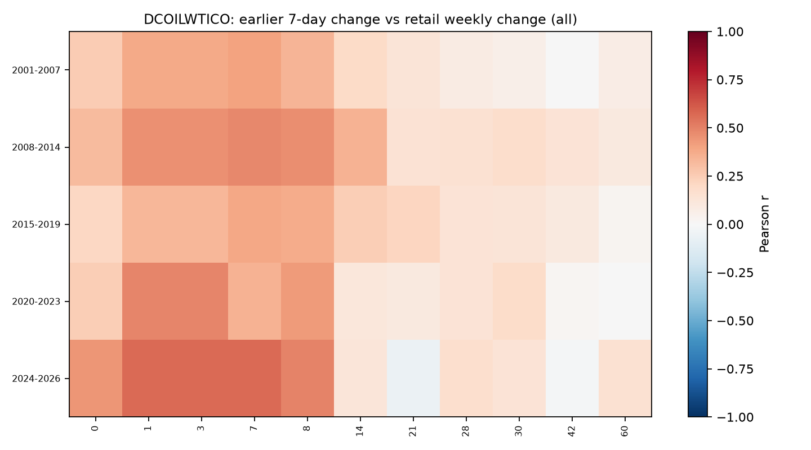
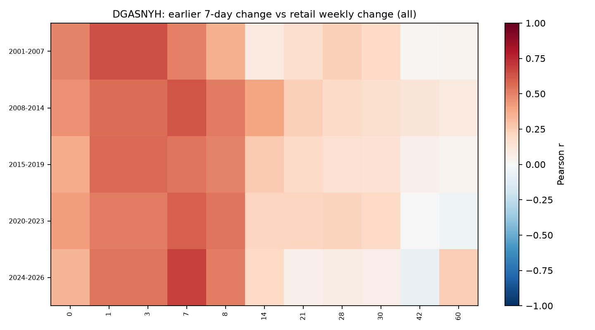
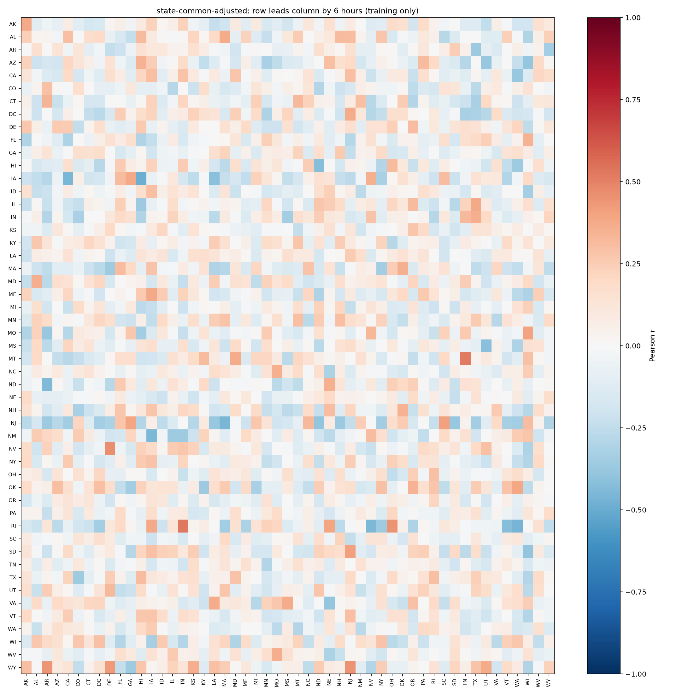

# Where price changes lead other prices

There is a useful historical oil/wholesale signal, concentrated nearer one week than one month. The short nationwide station panel does not yet identify a trustworthy regional leader. All results concern reported prices, not verified pump truth.

## The exact 30-day question

We can pair our current gasoline changes with oil changes 30 days earlier. A month of station history is **not required to compute that correlation**. The limiting quantity is the number of independent date pairs, rather than how far back we look for oil.

The current training slice provides four UTC dates, with incomplete days and historical collection gaps. Pairing the average observed hourly gasoline movement on those dates with oil's daily change 30 days earlier gives WTI **r = −0.479** and Brent **r = +0.438**. Opposite answers from related benchmarks on only four dates illustrate the instability. These are exploratory numbers, not evidence that either direction will predict new days. The CSV records every pair, observed-hour count and actual oil source date; it does not multiply one daily oil observation into 141,660 independent samples.

[Exact recent date pairs](correlations/recent-oil-date-pairs.csv) · [Recent lag matrix](correlations/recent-oil-lag-matrix.png)

## Longer historical oil and gasoline comparison

For each retail observation, compare its weekly change with the oil/wholesale seven-day change ending 0, 1, 3, 7, 8, 14, 21, 28, 30, 42 or 60 calendar days earlier. Separate five eras and rising/falling crude regimes. Level correlations are retained separately; primary conclusions use changes to avoid mistaking long-running shared trends for useful prediction.

WTI change correlations across the five eras:

| Oil lag | Range of correlations with retail weekly change |
|---|---:|
| Same observation date | 0.21–0.44 |
| Eight days | 0.34–0.50 |
| Fourteen days | 0.11–0.35 |
| Thirty days | 0.06–0.18 |

This does not establish an exact eight-day physical transmission delay. Retail is weekly, crude is daily, weekends repeat the last market observation, and observations dated the same day are not necessarily available at the same time. In particular, the one- and three-day lag views frequently select the same Friday crude price. A six-hour oil effect is not measurable from these data.

Wholesale gasoline also carries signal. New York Harbor's eight-day correlations range **0.36–0.54**, versus **0.07–0.20** at 30 days. Gulf Coast's eight-day range is **0.33–0.52**. Rising/falling conditional correlations vary by era; they do not support a universal one-size-fits-all delay or a reliable conclusion about asymmetric pass-through speed.

### Does it improve a prediction?

Predict the next weekly US regular-gasoline change. Train on 2001–2023, choose ridge regularization on 2024, refit through 2024, and score 91 weekly observations in 2025–2026. Every external predictive feature is at least eight calendar days old. This historical evaluation interval was already examined in the earlier research: it is **not fresh confirmation**, and current-vintage data do not fully reconstruct historical publication revisions.

| Inputs | MAE, cents/gal | 95th-percentile error |
|---|---:|---:|
| Keep last weekly gas price | 5.656 | — |
| Gas history and season | 5.232 | 13.685 |
| Above + only 30-day crude changes | 5.191 | 13.795 |
| Above + multiple crude lags | 4.887 | 13.304 |
| Above + crude and wholesale lags | **4.706** | **12.975** |

Only-30-day inputs improve mean error by **0.041 cents**, with an eight-week-block 95% interval of **−0.112 to +0.019 cents** for model-minus-baseline error: inconclusive, with slightly worse tail error. Multiple crude lags improve mean error by 0.345 cents; adding wholesale lags improves it by **0.526 cents (10.0%)** over gas history, or **16.8%** over last price. The latter model-minus-gas-history interval is **−0.847 to −0.216 cents**. These intervals account for short-range temporal dependence, not repeated research selection or vintage uncertainty.

The useful candidate is a **distributed history of oil and wholesale changes**, not a hardcoded 30-day rule. This is an aggregate weekly predictor; it has not demonstrated the same improvement for individual stations. Models and exact reloaded predictions are saved.

[All historical correlation views and counts](correlations/oil-lag-all-views.csv) · [Prediction outcomes](correlations/oil-predictions.csv) · [Model details](correlations/oil-summary.json)

## Nationwide hourly transmission

Use all 141,660 inventory IDs, 51 states/DC, and 14 fuel/payment products in the existing immutable export. Discovery uses only the first 69 snapshot hours before the original training boundary. Missing collection remains missing. A state movement is the mean change among stations priced at **both adjacent snapshots**, rather than the difference between two changing populations.

Generate state matrices at 0, 1, 3, 6, 12 and 24 hours; repeat after subtracting other states' contemporaneous average movement; separately analyze source-report refresh rates. Additional matrices cover grades/payment methods and fixed initial cheap/expensive and fresh/aged quote cohorts.

Among **12,750 directed state-pair/lag tests**, **none** survives 5% false-discovery-rate correction under the exploratory circular-shift test. Some raw correlations are large: Texas preceding Hawaii by 24 hours has r=0.773 on only 32 paired hours, but its adjusted q value is 0.753. This is a candidate to watch, not evidence of a Texas-to-Hawaii transmission mechanism. Shared collection/report schedules, autocorrelation and the very short window remain serious confounders. The shift test itself assumes approximate stationarity and has coarse resolution.

A fixed chronological check inside training data also found no useful gain from the broad state-lag input: average state hourly-change MAE was **0.04507 cents** using all states' previous 1/3/6-hour moves, **0.04371** using only the target state's history, and **0.04374** predicting no change. Each state had about 24 training hours and 20 evaluation hours, with a six-hour purge; this is a small exploratory check, not the final station benchmark.

[All regional candidates and adjusted tests](correlations/regional-lead-candidates.csv) · [Regional forecast check](correlations/regional-prediction-check.csv) · [Actual paired coverage](correlations/state-paired-counts.csv)

## What to use

- Keep multiple crude and wholesale lags as candidates for aggregate weekly forecasts. One month is testable, but adds little alone in this experiment.
- Keep station history, nearby changes and same-station grade/payment spreads in the station-model comparison. Do not hardcode a state-leading-state rule from these matrices.
- Treat update-age classification as predicting a future reported correction, not proving physical pump staleness.
- Preserve the final October 5–7 evaluation window. Neither this study nor the new training runs reads it. No production prices or rankings changed.

## Reproduction and sources

`correlation_study.py` produces historical and national matrices; `recent_oil_pairs.py` produces the exact short-panel 30-day comparison. CSVs, PNGs, source snapshots, model weights, prediction outputs, source hashes and counts are stored under `correlations/`. Unit tests verify lag direction and missing/constant-series behavior. The national summary records the immutable manifest hash.

Official source definitions: [WTI crude](https://fred.stlouisfed.org/series/DCOILWTICO), [Brent crude](https://fred.stlouisfed.org/series/DCOILBRENTEU), [weekly US regular retail gasoline](https://fred.stlouisfed.org/series/GASREGW), [New York Harbor gasoline](https://fred.stlouisfed.org/series/DGASNYH), [Gulf Coast gasoline](https://fred.stlouisfed.org/series/DGASUSGULF). The [EIA publication schedule](https://www.eia.gov/petroleum/supply/weekly/pdf/appendixb.pdf) distinguishes Monday measurements from later release times.
