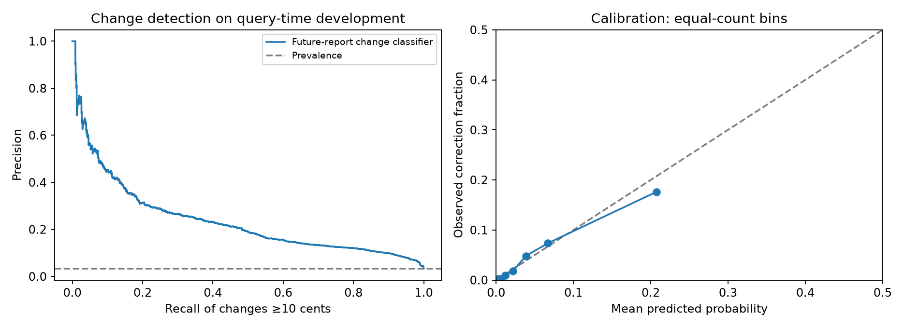
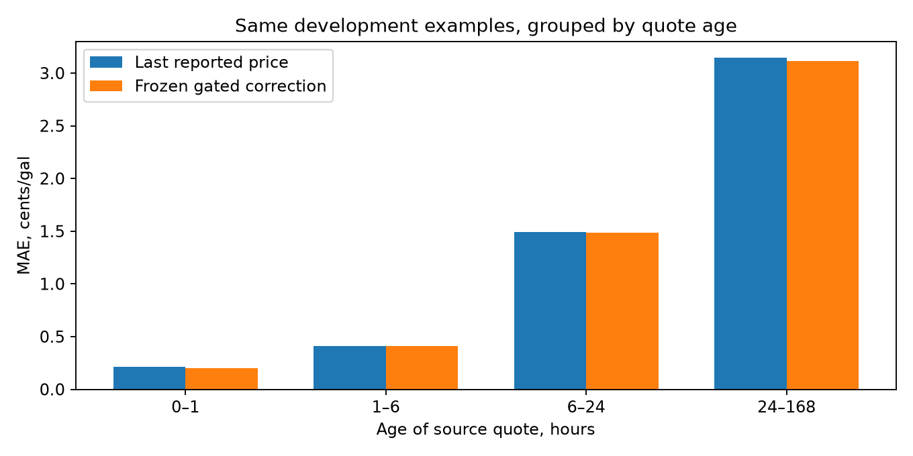

# Nationwide price-model and correlation results

The research found small, selective station-price improvements and a more useful aggregate weekly oil/wholesale signal. It does **not** establish a better production station-ranking system. The later station check is only four overnight hours with substantial missing future labels. The final October 5–7 window remains untouched; no production prices or rankings changed.

[Correlation matrices and oil-lag findings](CORRELATIONS.md) · [Frozen experiment definition](FROZEN_CONFIRMATION.json) · [Protocol](PROTOCOL.md)

## What was actually trained

The original export covers all 141,660 fixed-inventory IDs, not a city-only sample. Missing prices remain missing. The source-event task has **2,062,756 training / 145,644 development** examples. A separate query-time task has **858,713 training / 31,410 development** examples, including old quotes between updates. Same-station grade/payment duplicates and repeated queries are dependent observations, not millions of independent market days.

Added 69 causal features to the original 47: station distributions over 6/24/48 hours, persistent grade/payment spreads, changes/reversals, peer movements and fresh-price disagreement. Peer features use previous-hour data; same-station historical spread estimates exclude the current hour. Coordinates are included, station identity is not.

Trained six boosted-tree variants per task (RMSE, MAE, Huber, different depth and feature ablations), an independent future-change classifier, and national-context neural networks of approximately **2 million and 7.75 million parameters**. The national networks receive every priced inventory record through 51 state/DC summary tokens. This compresses the national snapshot; it is not literal attention over 141,660 raw station tokens. Original regional/local features remain in the variant named `station_rmse8`; that ablation removes the nine newly added peer features, not all geographic context.

Actually fine-tuned **Qwen3-0.6B-Base**, pinned to revision `da87bfb608c14b7cf20ba1ce41287e8de496c0cd`, using LoRA plus numeric input/output projections: **601,294,850 total / 5,244,930 trainable parameters**. Six station-feature tokens, two compressed national-context tokens and a query token make nine numeric soft tokens per example. This is pretrained-backbone numerical adaptation, **not text instruction tuning**. The source-event checkpoint completed one full pass over 2,062,756 examples; an intentionally discarded partial second pass is excluded from checkpoint-training counts. Query-time continuation and a down/unchanged/up mixture are reported separately as development challengers below.

These are predictive-system comparisons at different training budgets. Simultaneous CPU/GPU work and different numbers of passes preclude architecture-speed or parameter-efficiency claims. Saved specifications, histories, environment versions and source hashes retain the actual accounting.

## Frozen primary policies

Both policies were frozen, hashed and pushed before exporting the later four hours. Exact saved-model replay reproduced every earlier evaluation prediction with **maximum difference 0**.

| Task | Development last-price MAE | Frozen-model MAE | Later last-price MAE | Later frozen-model MAE |
|---|---:|---:|---:|---:|
| Immediately after source updates | 0.2188¢ | 0.2063¢ | 0.1863¢ | 0.1621¢ |
| Regular queries, including aging quotes | 0.8232¢ | 0.8138¢ | 0.7985¢ | 0.7797¢ |

Do not compare the two tasks' errors as though one model improves on the other. Their sampling and age distributions differ.

**Source-event rule:** equal-weight ensemble of the two enriched national networks, apply only predicted changes of at least 5¢, cap correction at ±20¢. Development improvement **5.7%**. Later improvement **13.0%** on 57,792 examples, including 264 changes of at least 10¢. It made 184 adjustments: 118 improved and 66 worsened. Large-change MAE fell from 33.20¢ to 25.89¢; error on the other examples rose from 0.0349¢ to 0.0440¢. Maximum observed worsening was 17.97¢.

**Query-time rule:** the 107-feature tree, gated by the independent change classifier at probability ≥0.75, capped at ±20¢. Development improvement **1.1%**. Later improvement **2.4%** on 12,654 examples, including 429 changes of at least 10¢. It made **21 adjustments: 18 improved, 3 worsened**, across 20 stations. Large-change MAE fell from 17.89¢ to 17.23¢; error on other examples rose from 0.1989¢ to 0.2024¢. Maximum observed worsening was 16.92¢. For quotes 24–168 hours old, MAE fell from 3.223¢ to 3.150¢; 6–24-hour quotes were essentially unchanged.

The later data spans October 4 02:00–05:00 UTC, using only completed archives with deadlines before the fixed 06:00 cutoff. The label is a later independently newer provider report, not a current verified pump price. The cutoff excludes many slower-to-update targets: **92,776 query candidates have no available qualifying target**, versus 12,654 labeled queries. The source-event task similarly has 92,582 unlabelled events. This short, right-censored overnight sample can favor fast updates and cannot establish day-long reliability.

## Uncertainty and station choices

Station-group bootstrap intervals favor both frozen corrections, but stations share regional shocks. A more conservative state-block bootstrap gives model-minus-last-price MAE intervals:

- Source-event model: **−0.0572 to +0.0026 cents**, crossing zero.
- Query-time model: **−0.0416 to −0.0018 cents**.

Neither interval accounts for every shared national shock or substitutes for another time period. These are small absolute improvements.

The price-only ranking probe covers 644 panels of at least five stations. The source-event model changed 40 choices. **39 lacked a comparable pair of later reports; the one comparable change chose a station 5¢ more expensive.** The query-time rule changed no choices. Therefore this experiment has not demonstrated better station selection, even though average price error improved. These panels also omit distance, memberships and preferences, and later reports are not simultaneous pump truth.

[Later scores, age slices and predictions](artifacts/confirmation/) · [State-block and paired-choice diagnostics](artifacts/confirmation/dependence-and-ranking.json)

## Detecting likely future corrections

The query-time classifier predicts a newer report changing by at least 10¢ within 24 hours. Development prevalence is **3.31%**, average precision **0.237**, ROC AUC **0.881**, and Brier score **0.0285**. This predicts future reported corrections; it does not prove current pump staleness.

| Probability threshold | Flags | True changes | False alarms | Precision | Recall |
|---|---:|---:|---:|---:|---:|
| 0.10 | 2,824 | 526 | 2,298 | 18.6% | 50.5% |
| 0.25 | 746 | 225 | 521 | 30.2% | 21.6% |
| 0.50 | 163 | 79 | 84 | 48.5% | 7.6% |
| 0.75 | 37 | 27 | 10 | 73.0% | 2.6% |

The conservative correction rule misses most large changes. A lower threshold may be more useful for prioritizing refreshes than automatically replacing prices, but this is an unimplemented research candidate subject to collection budgets and provider limits.

Training split importance emphasizes quote age, geography, regional disagreement and fresh-neighbor disagreement. This is descriptive model importance, not causal proof. Full feature ablations and every selected/unselected policy remain in the comparison artifacts.

## Development challengers

The source-event Qwen checkpoint's sparse 3¢-threshold/20¢-cap rule reached 0.2090¢ MAE, about 4.5% below last price, but did not beat the frozen national ensemble. Larger parameter count did not guarantee a better result.

The query-time Qwen continuation completed **two full passes**, 1,717,426 additional examples / 15,456,834 numeric tokens in 2,022 seconds. Including its one completed source-event pass, the retained training lineage has 3,780,182 examples / 34,021,638 numeric tokens. Its selected sparse rule reached **0.8200¢ MAE**, only **0.39%** better than last price and worse than the simpler frozen rule. Continuous unbounded Qwen corrections reached 1.0723¢ MAE, worse than the 0.8232¢ raw baseline. Its ≥10¢-change classifier average precision was 0.187, below the tree classifier's 0.237.

The directional mixture trained a 1,562-tree three-class classifier and separate down/up magnitude regressors (1,372 and 342 trees), taking 1,681 seconds. Its fixed 0.75 direction-confidence threshold achieved **0.8009¢ MAE, 2.7% below last price**, the best result among 241 query-time development policies. It made 294 corrections: **189 helped, 105 hurt**, across 220 stations; maximum worsening remained 20¢. Large-change MAE fell from 16.93¢ to 16.19¢, and the >10¢ error rate fell from 1.716% to 1.662%. The 0.5 threshold worsened MAE to 0.8429¢, showing why indiscriminate corrections are harmful. Its change-classification AP of 0.433 uses a **1¢** event definition, so it is not directly comparable to the ≥10¢ classifiers.

[Freeze this challenger for future evaluation](FROZEN_CHALLENGER.json). It has **not** been tested against the later slice already exposed for the primary rules. The query-time Qwen continuation and directional mixture were still running when the primary policies were frozen. Their final development results are recorded separately; neither may replace or retune a primary policy using the now-examined later slice. Any promising challenger requires the still-unread final evaluation.

## Oil, geography and what to use

The [correlation study](CORRELATIONS.md) includes state leads, common-market-adjusted leads, report refreshes, grade/payment groups, cheap/expensive and fresh/aged cohorts, historical oil/wholesale delays, rising/falling regimes and rolling forecast eras.

A 30-day oil lag is computable with older oil observations paired to current gasoline observations. The current short panel has only four independent daily date pairs: it gives opposite signs for WTI and Brent. Longer history shows a more stable association nearer one week. Thirty-day-only inputs add little predictive value. Multiple oil and wholesale lags reduced historical weekly aggregate forecast error **7.8% versus the stronger previous gas-history benchmark**, and **16.9% versus last weekly price**. This aggregate result does not establish a comparable station-level gain, and it failed in one of five historical forecast eras.

No state-to-state lead survives the nationwide multiple-comparison check. No six-hour crude effect can be identified from the available daily crude / weekly retail series. Daily spot-market lead matrices are included separately and do not invent intraday observations.

The defensible research candidates are selective corrections, report-refresh prioritization, and distributed oil/wholesale features for weekly aggregate forecasts. None warrants replacing the app's observed prices or changing production ranking on this evidence alone.

## Verification and artifacts

- Fifteen focused tests cover feature causality, future-data perturbations, missing labels, lag direction and constant/missing correlation inputs.
- Both frozen station policies replay exactly from saved weights; all thirteen query-time regression/policy outputs, including Qwen and the four directional rules, also replay exactly. Historical oil models replay exactly after reload.
- All **5,046** included immutable archives were checked for bytes, SHA-256, exact catalog IDs, fixed regional provenance and timestamps; missing cells remain NaN. The later export adds 288 objects, not new provider calls.
- Input schemas and shard hashes, checkpoints/adapters, predictions, classifiers, numerical matrices, plots and source snapshots are preserved. Raw nationwide history remains in the immutable research archive.
- Texas/DC geographic assumptions and the Texas one-ID aggregate discrepancy remain catalog limitations. Missing targets and missing prices are not invented observations.
- The final October 5 18:19 through October 7 18:19 UTC window remains unread. No app UI, collector behavior, budgets, production prices or ranking changed.
