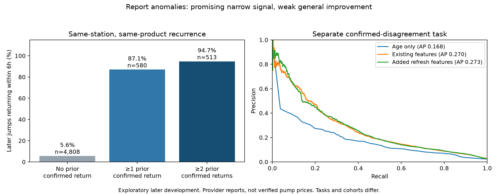

# A strong narrow signal: repeated freshly timestamped price oscillation

The most useful new signal is **a station/fuel/payment combination repeatedly jumping by at least 10 cents and returning near its prior price within six hours**, despite fresh source timestamps. It identifies an unreliable reporting pattern. It does not identify the physically correct side of an oscillation, prove a human spoofed a price, or establish a rewards motive.

These are exploratory results from existing verified nationwide archives through October 4 06:00 UTC. No new provider calls, production price changes, or ranking changes were made. The reserved October 5 18:19–October 7 18:19 final period remains untouched.



## Repeated reversal signal

A historical episode is usable only after a newer source report returns within 3 cents of the pre-jump price and a further newer-timestamp observation at least one hour later supports that return. Both must arrive within six hours of the jump. The historical evidence must be available strictly before the new jump being assessed. Separate timestamps do not prove separate reporters.

Later-development assessment starts October 3 06:19 UTC. Each assessed jump needs at least four valid subsequent hourly observations and a newer source timestamp within six hours. There are 5,388 eligible fuel/payment jump observations across 2,466 stations; 775 return. Another 9,236 later jump observations lack the required follow-up and are **unknown**, not negatives. Late hours without a full six-hour window are excluded before this count.

| Prior confirmed returns for the same station/fuel/payment | Later jumps assessed | Returned within six hours | Return rate |
|---|---:|---:|---:|
| None | 4,808 | 270 | 5.6% |
| At least one | 580 | 505 | 87.1% |
| At least two | 513 | 486 | 94.7% |
| At least three | 503 | 481 | 95.6% |

The two-prior-episodes rule covers **48 stations**, 505 station-hour episodes, and 62.7% of the 775 observed returns in this eligible cohort. All 513 flagged quotes have source age under one hour. A further newer report supports 443 of their returns. Counting only the first qualifying flag per station gives 44/48 returns (91.7%), of which 41 have further confirmation. The equal-station-weight return rate is 86.1%. Station-cluster bootstrap interval for the row-weighted rate is 91.9–96.9%; state-cluster interval is 83.9–97.0%. These are descriptive intervals, not protection against selection bias or future regime changes.

### Concentration materially limits generalization

452/513 flags are midgrade credit prices. Indiana, Illinois, Kentucky and Missouri account for 460/513. Outside midgrade, 43/61 return (70.5%, 14 stations); outside those four states, 36/53 return (67.9%, 10 stations). The headline rate is therefore a strong signal for a concentrated recurring pattern, **not 95% accuracy at detecting all wrong gas prices**.

An illustrative station's midgrade quote alternates **$3.22 → $3.89 → $3.22 → $3.89**, each with a newly advanced timestamp, while its other grades remain unchanged. Four original immutable archives from October 3 02:00–05:00 UTC were read back, SHA-256 checked, and matched to the analysis arrays, including source timestamps and the unchanged Virginia execution region. This episode was not introduced by the analysis array mapping or by switching workers. The archive retains provider prices/timestamps but no reporter identity. Conflicting automated feeds, provider processing, mistaken reports, malicious reports and real temporary prices cannot be distinguished from this evidence alone. See `artifacts/archive-proof.json`.

## Broad stale-price detector: no convincing improvement

A separate experiment asks whether two later, successively newer timestamped reports agree within 3 cents while both differ from the current quote by at least 10 cents in the same direction. Stable negatives require both remain within 3 cents of the current quote. Other outcomes are unknown. This is a **confirmed report-disagreement proxy**, not a verified stale pump price, and it is different from the reversal task above.

Of 902,777 pre-existing eligible query examples, 448,263 lack confirmation, 50,037 are ambiguous and 106,988 cross split boundaries. Remaining rows: 189,170 training (9,414 positive); 33,537 calibration (549 positive); 74,782 later development (1,708 positive, 16,477 stations). Training and labels end before October 2 18:19 UTC; calibration and labels end before October 3 06:19 UTC. Later outcomes are excluded from fitting, early stopping and threshold selection. Other studies had previously examined this development period, so it is not the untouched final test.

Four boosted classifiers were trained, including a matched-capacity comparison of the existing 116 features against 140 features. Added inputs cover timestamp refreshes without price movement, report interval regularity, source rollback, and agreement between within-station and neighborhood anomalies.

| Inputs | Later average precision | Precision / recall at calibration-selected threshold |
|---|---:|---:|
| Age alone | 0.1684 | No threshold met the calibration requirement |
| Age + refresh/cadence history | 0.1843 | No threshold met the calibration requirement |
| Existing 116 features | 0.2703 | 67.1% / 8.4% (143 true, 70 false flags) |
| Added features, 140 total | 0.2725 | 58.2% / 12.1% (206 true, 148 false flags) |

Thresholds were selected for at least 70% calibration precision and 30 flags, maximizing recall; that precision did not hold on later development. The added-feature AP difference is just +0.00219, with station-bootstrap 95% interval **−0.00487 to +0.00840**. It is not a convincing improvement. Repeated refreshing by itself should not be treated as fraud or as grounds to suppress a price. Preserved artifacts include every model, parameters, feature list, threshold, predictions, slice metrics, and checkpoint hashes.

## What can be used

Freeze the two-prior-confirmed-reversals rule as a **separate research reliability flag** for incoming large jumps at previously oscillating station/fuel/payment combinations. Keep tracking report age separately. Neither a fresh timestamp nor many repeated updates should automatically restore trust to a repeatedly oscillating series. The flag identifies disagreement/instability; it does not choose which quote to substitute. The final-period evaluation should report coverage, unknown outcomes, first station flags, product/state slices, and both directions of each oscillation before any production decision.

No production estimator was promoted. Existing frozen prediction candidates remain unchanged. The broader stale-price classifier still needs substantially stronger evidence or independent pump-price verification.

## Verification and reproduction

Nine tests pass: future-perturbation invariance, distinct timestamp requirements, transient versus confirmed outcomes, missing follow-up, valid stable confirmation, future source rejection, strict split purges, historical-evidence availability and calibration threshold support. Every saved classifier was reloaded and its predictions replayed (maximum difference below 3e-8 from float32 export). Four original archive read-backs pass hashes, routing and price/time equality. The figure was rendered and visually inspected. Research-only changes require no phone launch.

Use Python with NumPy, scikit-learn, CatBoost 1.2.10 and Matplotlib; exact versions are in `artifacts/environment.json`. Commands, from the repository root:

```sh
python -m unittest discover -s scripts/price-model/report-reliability -p 'test_*.py'
python scripts/price-model/report-reliability/build.py --arrays /private/tmp/fuel-confirm-v2/arrays --datasets /private/tmp/fuel-hourly-v2/dataset-enriched /private/tmp/fuel-confirm-query/enriched --out /private/tmp/fuel-report-reliability/dataset-query
python scripts/price-model/report-reliability/train.py --data /private/tmp/fuel-report-reliability/dataset-query --out /private/tmp/fuel-report-reliability/models
python scripts/price-model/report-reliability/reversal_audit.py --arrays /private/tmp/fuel-confirm-v2/arrays --out /private/tmp/fuel-report-reliability/audit
python scripts/price-model/report-reliability/recurrence.py --arrays /private/tmp/fuel-confirm-v2/arrays --out /private/tmp/fuel-report-reliability/audit
python scripts/price-model/report-reliability/diagnostics.py --root /private/tmp/fuel-report-reliability --arrays /private/tmp/fuel-confirm-v2/arrays --out /private/tmp/fuel-report-reliability/diagnostics
python scripts/price-model/report-reliability/verify_evidence.py /private/tmp/fuel-confirm-v2 /private/tmp/fuel-report-reliability/audit/archive-proof.json
```

The temporary inputs derive from the prior committed prospective ingestion/feature tools and the immutable export manifest `a85caa070501bc02b6a74d2efc3f4a301c9f98839bff42cc5ce352bf938dbb19`. Query examples with no original newer target were absent from those pre-existing datasets; their population is not represented in the classifier results. Static geographic metadata and repeated station overlap retain the limitations documented by the prior study. Research artifacts are backed up with this change; raw nationwide archives remain immutable in their existing storage.
